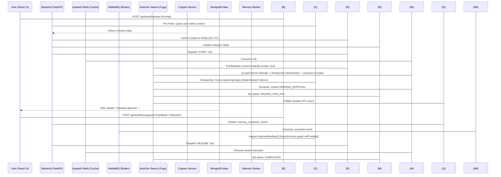
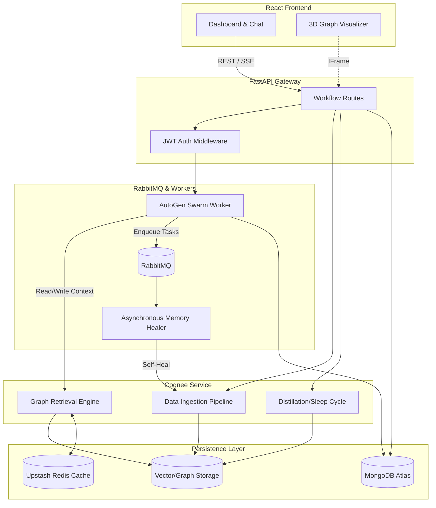

<p align="center">
  
</p>

<h1 align="center">NexusAI + Cognee Memory</h1>

<p align="center">
  <strong>Advanced Stateful Multi-Agent Swarm Orchestration with Hybrid Graph-Vector Memory</strong>
</p>

<p align="center">
  
  
  
  
  
  
  
  
</p>

<hr />

## 🌟 Vision & The "Amnesia" Upgrade
**NexusAI** is a cloud-native, stateful **digital workforce**. 

### The Upgrade: Stateful Memory
Standard LLM orchestration swarms suffer from **LLM Amnesia**—waking up in new sessions with zero context of previous user preferences, integrations, or prior mistakes. 

By integrating **Cognee's hybrid graph-vector memory fabric**, NexusAI has upgraded from a stateless pipeline to a **cognitive operating system**. The agent swarm now carries permanent, cross-session context, learns dynamically from user corrections, tracks chronological episodes, and optimizes its context window autonomously.

---

## 🛠️ Tech Stack & Infrastructure

- **🖥️ Mission Control (Frontend)**: React dashboard featuring Glassmorphism, Framer Motion UI animations, live execution telemetry, and a tabbed **Active Workspace** to toggle between real-time agent execution flow and an interactive **3D Graph Memory Viewer**.
- **🚀 Neural Gateway (Backend)**: FastAPI serving as a fully asynchronous API gateway.
- **🧠 Agent Swarm**: Powered by **Microsoft AutoGen (v0.4.x)** chat group. Specialized agents query and edit long-term memory dynamically via Cognee toolsets.
- **💾 Short-Term State (MongoDB Atlas)**: Handles short-term operational logs, sessions state, and workflow execution snapshots.
- **⚡ Zero-Latency Cache (Upstash Redis)**: Handles fast queueing and acts as the **Distributed Caching Layer for Cognee** (session cache + memory pre-fetch).
- **🛡️ Asynchronous Graph Healing (RabbitMQ)**: CloudAMQP RabbitMQ handles durable queues for Human-in-the-Loop (HITL) alerts and queues `memory_correction_events` to update graph weights asynchronously.

---

## 🗺️ System Architecture



---

## 👥 The Cognitive Swarm + Memory Tooling

| Agent | Role | Model | Cognee Memory Integration |
| :--- | :--- | :--- | :--- |
| **Planner** | The Architect | `Gemini-1.5-Pro` | Uses `cognee_recall_tool` to query past sessions for preferred frameworks and formatting habits. |
| **Researcher** | The Investigator | `Gemini-1.5-Pro` | Uses `cognee_remember_tool` to dynamically ingest document files, URLs, and facts directly into the graph. |
| **Executor** | The Operator | `Gemini-1.5-Pro` | Uses `cognee_forget_tool` to prune outdated tool states or deleted dataset nodes. |
| **Reviewer** | The Auditor | `Gemini-1.5-Pro` | Triggers `/approve` routing. Captures human feedback to re-weight memory weights via `cognee.improve()`. |

---

## 🌌 Enterprise-Grade Capabilities

### 1. Interactive 3D Memory Graph Visualizer
Render a live, interactive 3D map of the agent's cognitive graph directly in the React interface.
* **API**: `GET /api/workflow/{session_id}/visualize`
* **UI**: Toggled in the **Active Workspace** dashboard tab. The React app renders Cognee’s network visualization HTML dynamically inside an iframe.

### 2. Observability & Memory Tracing
Proof of clean, explainable AI reasoning. Expose the exact graph traversal pathways the swarm took to reach an answer.
* **API**: `GET /api/workflow/{session_id}/traces`
* **Feature**: Leverages Cognee's internal OpenTelemetry tracer to return tree structures and operation summaries of retrieved graph nodes.

### 3. Swarm "Dream/Sleep Cycles" (Session Distillation)
Avoid bloated graphs. Keep the context window lean and cost-effective.
* **API**: `POST /api/workflow/{session_id}/dream-distill`
* **Feature**: Consolidates raw conversational session logs and task metrics, distills them into generalized long-term rules, updates the permanent graph, and purges redundant raw files.

### 4. Cross-Platform Memory Importer
Highly compatible with the wider ecosystem. Load memory graphs from other platforms seamlessly.
* **API**: `POST /api/workflow/{session_id}/migrate-import`
* **Feature**: Built-in compatibility with **Mem0**, **Letta**, and **Zep** export JSON files, restructuring them into Cognee's graph format.

### 5. Chronological Episodic Timeline Ingestion
Most memory engines lose track of *when* things happened.
* **API**: `POST /api/workflow/{session_id}/temporal-ingest`
* **Feature**: Integrates `graphiti_core` tasks to construct sequential, time-aware episode links, giving the swarm chronological context.

---

## 🏗️ Deep-Dive: Cognitive Architecture

The following component diagram illustrates the complex interplay between the multi-agent swarm, the dynamic memory ingestion pipeline, and the persistence layers.



---

## 🚀 Quick Start (Local & Cloud)

### 1. Environment Configuration
Update `.env` in the `backend/` directory:
```env
# Gemini Core Keys
GEMINI_API_KEY_PLANNER="..."
GEMINI_API_KEY_RESEARCHER="..."
GEMINI_API_KEY_EXECUTOR="..."
GEMINI_API_KEY_REVIEWER="..."

# Databases & Infrastructure
MONGO_URI="mongodb+srv://..."
REDIS_URL="rediss://default:..."
RABBITMQ_URL="amqps://..."

# Cognee LLM & Caching Config
LLM_PROVIDER="gemini"
LLM_API_KEY="your-gemini-key"
LLM_MODEL="gemini/gemini-1.5-pro"
EMBEDDING_PROVIDER="gemini"
EMBEDDING_MODEL="gemini/text-embedding-004"

# Cognee Caching (Connected to Upstash Redis)
CACHING="true"
CACHE_BACKEND="redis"
CACHE_HOST="your-upstash-redis-host.upstash.io"
CACHE_PORT=6379
CACHE_USERNAME="default"
CACHE_PASSWORD="your-upstash-password"
```

### 2. Launch the Gateway & Workers
```bash
# Terminal 1: Launch FastAPI Gateway
cd backend
pip install -r requirements.txt
python -m uvicorn main:app --reload --port 8000

# Terminal 2: Launch Swarm Worker
python src/services/worker.service.py

# Terminal 3: Launch Async Memory Worker (RabbitMQ Graph Healing)
python memory_worker.py
```

### 3. Launch Frontend
```bash
cd frontend
npm install
npm run dev
```

---

## 🔒 Security & Privacy
- **JWT Protection**: All gateways endpoints are secured via JWT tokens.
- **Enterprise Brokers**: Tool execution and HITL pauses are handled by RabbitMQ to ensure no tasks are lost to single points of failure.
- **Safety First**: Destructive tool actions (emails, system deletes) are held in state until human approval is signed in the React panel.
