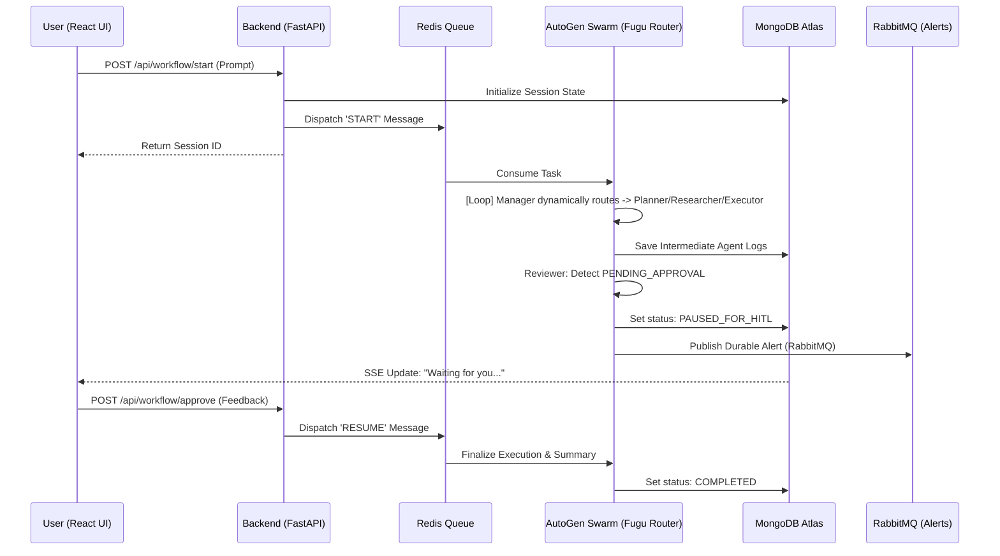

<!-- <p align="center">
  
</p> -->

<h1 align="center">NexusAI</h1>

<p align="center">
  <strong>Advanced Multi-Agent Orchestration Framework with Dynamic Routing</strong>
</p>

<p align="center">
  
  
  
  
  
  
  
</p>

<hr />

## 🌟 Vision
**NexusAI** is a cloud-native, highly scalable **digital workforce**. Built on the foundation of the Fugu-architected dynamic routing system, it uses an intelligent Manager LLM (Gemini 1.5 Pro) to dynamically delegate tasks across a specialized swarm of agents. It enforces strict **Human-in-the-Loop (HITL)** safety protocols using enterprise message brokers.

---

## 🛠️ Tech Stack & Infrastructure

- **🖥️ Mission Control (Frontend)**: A sophisticated React dashboard featuring Glassmorphism, Framer Motion UI animations, live execution telemetry, and interactive HITL approval flows.
- **🚀 Neural Gateway (Backend)**: FastAPI serving as a high-performance, fully asynchronous bridge between the UI and the agent swarm.
- **🧠 Agent Swarm**: Powered by **Microsoft AutoGen (v0.4.x)** utilizing a `SelectorGroupChat`. It relies on **Gemini 1.5 Pro's** massive 2-million token context window to handle massive cognitive loads and dynamic Fugu-style task delegation.
- **💾 State Persistence**: **MongoDB Atlas** (via Motor) handles durable session memory and workflow resumption horizontally.
- **⚡ Async Pulse (Redis)**: **Upstash Redis** handles the fast, ephemeral background task queuing, ensuring UI requests never block the main thread.
- **🛡️ Critical Alert System (RabbitMQ)**: **CloudAMQP RabbitMQ** handles highly durable, persistent queues specifically for Human-in-the-Loop (HITL) alerts and high-stakes operations that require guaranteed delivery.

---

## 🗺️ System Architecture



---

## 👥 The Agent Team

| Agent | Role | Model | Specialization |
| :--- | :--- | :--- | :--- |
| **Manager (Router)** | The Brain | `Gemini-1.5-Pro` | Dynamically selects the next speaker based on context history. |
| **Planner** | The Architect | `Gemini-1.5-Pro` | Decomposes prompts into precise workflows. |
| **Researcher** | The Investigator | `Gemini-1.5-Pro` | Handles Web Search (Serper MCP) and deep analysis. |
| **Executor** | The Operator | `Gemini-1.5-Pro` | Triggers MCP tools (Spotify, Brevo Email, API calls). |
| **Reviewer** | The Auditor | `Gemini-1.5-Pro` | Quality control and triggers Human-In-The-Loop (HITL) pauses. |

---

## 🚀 Quick Start (Local & Cloud)

### 1. Environment Setup
Create a `.env` file in the `backend/` directory:
```bash
# Core AI
GEMINI_API_KEY_PLANNER="..."
GEMINI_API_KEY_RESEARCHER="..."
GEMINI_API_KEY_EXECUTOR="..."
GEMINI_API_KEY_REVIEWER="..."

# Database & Queues
MONGO_URI="mongodb+srv://..."
MONGO_DB_DATABASE="NexusAldb"
MONGO_DB_CONTAINER="workflow_states"

REDIS_URL="rediss://default:..."
RABBITMQ_URL="amqps://..."

# Security
JWT_SECRET_KEY="your-random-secure-string"

# External MCP Tools
SERPER_API_KEY="..."
SPOTIFY_CLIENT_ID="..."
SPOTIFY_CLIENT_SECRET="..."
```

### 2. Launch the Backend
```bash
cd backend
pip install -r requirements.txt
python -m uvicorn main:app --reload --port 8000
```
*(Note: Since you are using cloud providers for MongoDB, Redis, and RabbitMQ, you do not need to run Docker locally!)*

### 3. Launch the Frontend
```bash
cd frontend
npm install
npm run dev
```

---

## 🔒 Security & Privacy
- **JWT Authentication**: All endpoints are protected with industry-standard tokens.
- **Enterprise Message Brokers**: High-stakes API tool executions and human-in-the-loop triggers are pushed through RabbitMQ to guarantee they are never lost to server failure.
- **Safety First**: No destructive actions (emails, API modifications) are sent without your explicit click in the dashboard, powered by the HITL Reviewer agent.
